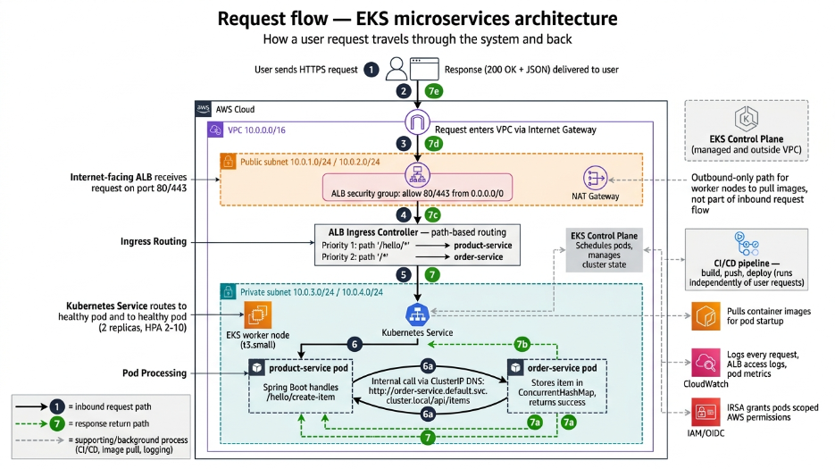
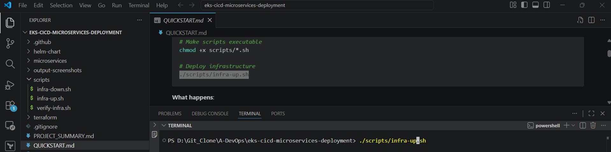
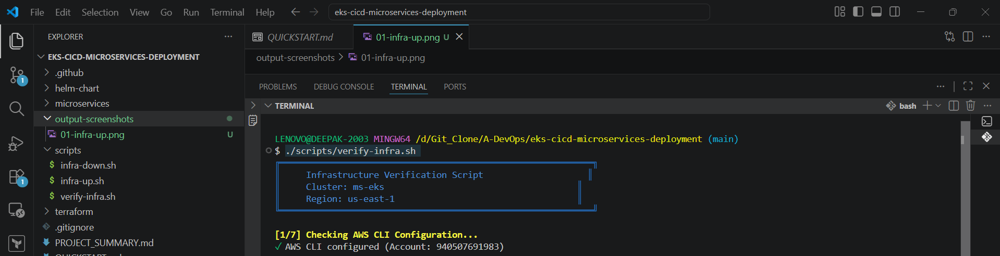
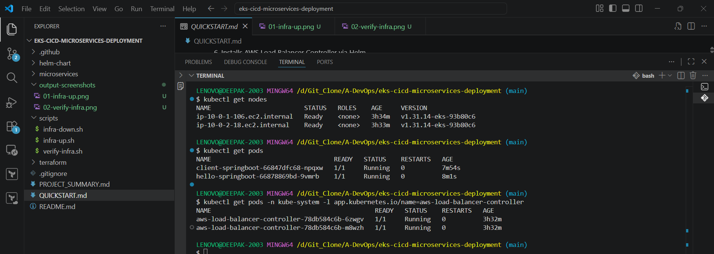
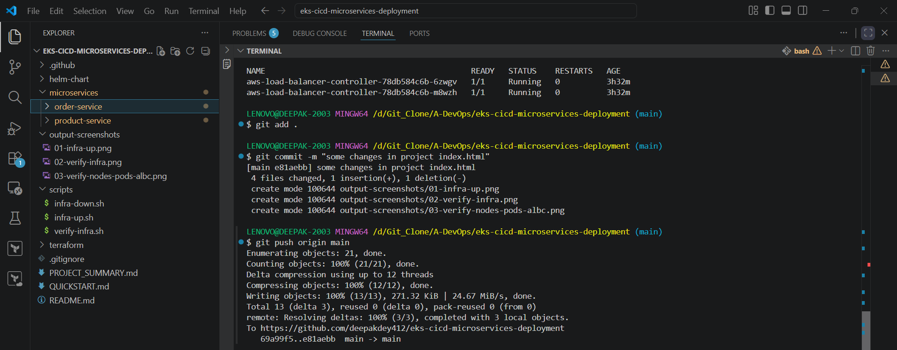
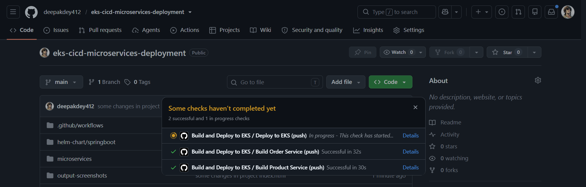
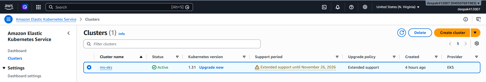
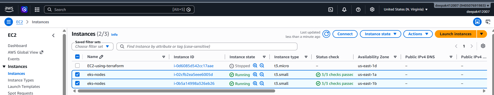
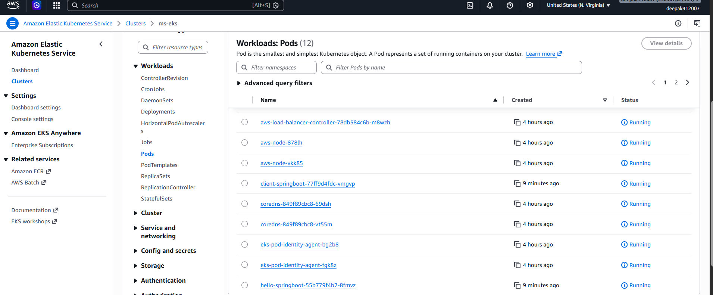
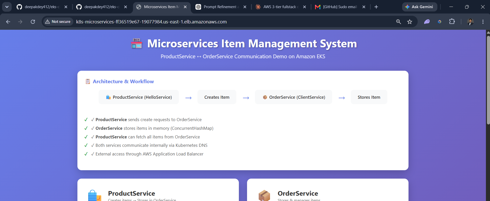

# EKS-CICD-Microservices-Deployment

Production-ready microservices demonstrating service communication, automated CI/CD, and infrastructure as code on AWS.

## Quick Overview

Two Spring Boot services on Amazon EKS:

- **product-service**: Creates and manages products
- **order-service**: Stores orders and serves web UI

Both communicate internally via Kubernetes DNS and are exposed via AWS Application Load Balancer.

## Quick Links

- 📘 [Setup Guide (QUICKSTART.md)](QUICKSTART.md)
- 📐 [Architecture & Flow (PROJECT_SUMMARY.md)](PROJECT_SUMMARY.md)
- 🏗️ [Infrastructure Details (terraform/INFRASTRUCTURE.md)](terraform/INFRASTRUCTURE.md)

## Get Started

```bash
# 1. Deploy infrastructure
./scripts/infra-up.sh

# 2. Verify deployment
./scripts/verify-infra.sh

# 3. Push code (triggers auto-deployment)
git push origin main

# 4. Access application
kubectl get ingress -n default
# Open http://<ALB-DNS>/ in browser
```

## Technology Stack

**Backend**: Java 17, Spring Boot 3.2.5, Maven  
**Infrastructure**: AWS EKS, VPC, ALB, Terraform  
**CI/CD**: GitHub Actions, Helm Charts  
**Container**: Docker, Amazon ECR

## Architecture



## Output Screenshots

Step-by-step outputs captured while deploying and verifying this project (see `output-screenshots/`):

| Step | Screenshot                                                                                                                                           | Description                                       |
| ---- | ---------------------------------------------------------------------------------------------------------------------------------------------------- | ------------------------------------------------- |
| 1    |                              | Running `infra-up.sh` to provision infrastructure |
| 2    |                      | Verifying infrastructure with `verify-infra.sh`   |
| 3    |  | Verifying nodes, pods, and ALB controller         |
| 4    |                          | Pushing code to trigger CI/CD                     |
| 5    |                    | GitHub Actions pipeline running                   |
| 6    |                        | EKS cluster view                                  |
| 7    |                    | EC2 instance / node details                       |
| 8    |                        | Pods running inside EKS                           |
| 9    |                | Final working project in the browser              |

## Cleanup

Destroy all resources to avoid charges:

```bash
./scripts/infra-down.sh
```

**Cost**: ~$5/day running, $0 when destroyed

## Troubleshooting

Run verification script:

```bash
./scripts/verify-infra.sh
```

Common issues:

- **Pods not starting**: Check logs with `kubectl logs <pod-name>`
- **ALB not created**: Check ALB controller logs
- **Can't connect**: Verify security groups and NAT Gateway

See [QUICKSTART.md](QUICKSTART.md) for detailed troubleshooting.

## Support

- **Setup Help**: See [QUICKSTART.md](QUICKSTART.md)
- **Architecture Questions**: See [PROJECT_SUMMARY.md](PROJECT_SUMMARY.md)
- **Infrastructure Issues**: See [terraform/INFRASTRUCTURE.md](terraform/INFRASTRUCTURE.md)
- **Issues**: [GitHub Issues](https://github.com/deepakdey412/EKS-project/issues)

## Contact

For any queries, feel free to DM me on LinkedIn: [linkedin.com/in/deepakdey](https://linkedin.com/in/deepakdey)

---
